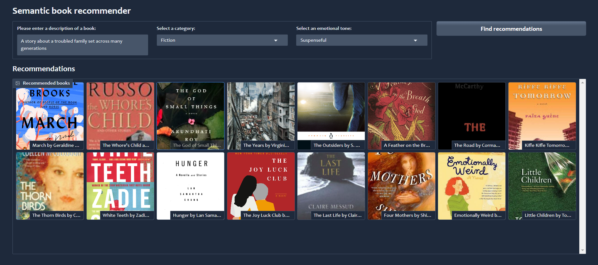
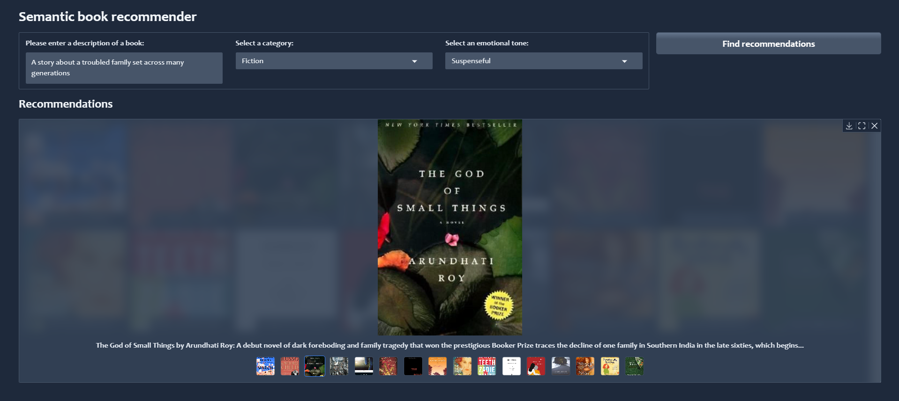

# BookSense: Semantic Book Recommender with LLMs
A robust book recommendation system that leverages advanced natural language processing (NLP) techniques—including vector embeddings, zero-shot text classification, and sentiment analysis—to semantically search a curated books dataset and deliver personalized recommendations via an interactive Gradio dashboard.

## Table of Contents
- [Overview](#overview)
- [Live Demo](#live-demo)
- [Project Snapshot](#project-snapshot)
- [Features](#features)
- [Architecture & Workflow](#architecture--workflow)
- [Installation](#installation)
- [Contributing](#contributing)
- [License](#license)
- [Contact](#contact)

## Overview
The Semantic Book Recommender project demonstrates an end-to-end application for processing a dataset of ~7,000 books. The project covers:
- **Data Exploration & Cleaning:** Using Python (Pandas, Seaborn, Matplotlib) to analyze missing values, compute correlations, and refine book descriptions.
- **Vector Search:** Converting tagged book descriptions into document embeddings using Hugging Face models and storing them in a Chroma vector database via LangChain.
- **Zero-Shot Text Classification:** Employing a transformer-based model (e.g., `facebook/bart-large-mnli`) to classify books as fiction/nonfiction.
- **Sentiment Analysis:** Analyzing book descriptions to extract emotional tone (anger, joy, sadness, etc.) with a fine-tuned transformer model.
- **Interactive Dashboard:** Presenting recommendations through a user-friendly Gradio interface that supports filtering by category and emotional tone.

## Live Demo
Check out the live application: [BookSense]()

## Project Snapshot
In case the live website is unavailable, here’s a preview of the application:

## Features
- **Comprehensive Data Analysis:** Detailed exploratory data analysis (EDA) to assess dataset quality and handle missing values.
- **Document Embeddings:** Utilizes state-of-the-art Hugging Face models to transform text into meaningful vector representations.
- **Semantic Search:** Implements vector-based similarity search to identify books that match a user’s descriptive query.
- **Zero-Shot Classification:** Leverages a pre-trained model for categorizing book descriptions without additional training.
- **Emotion Detection:** Integrates sentiment analysis to enable recommendation sorting based on emotional tone.
- **Interactive Gradio Dashboard:** Provides a real-time, user-friendly interface for querying and visualizing book recommendations.

## Architecture & Workflow
1. **Data Exploration:**  
   - Download and inspect the dataset using `kagglehub` and Pandas.
   - Visualize missing data patterns and calculate correlations to justify filtering (e.g., dropping books with insufficient descriptions).

2. **Data Cleaning & Feature Engineering:**  
   - Create new features such as `missing_description`, `age_of_book`, and a combined `tagged_description` (prepended with ISBN).
   - Save the cleaned dataset (`books_cleaned.csv`) for downstream processing.

3. **Vector Search Pipeline:**  
   - Use LangChain’s `TextLoader` and `CharacterTextSplitter` to split tagged descriptions.
   - Generate document embeddings using a Hugging Face model (e.g., `sentence-transformers/all-MiniLM-L6-v2`).
   - Build a vector database with Chroma and implement semantic similarity search.

4. **Zero-Shot Text Classification & Sentiment Analysis:**  
   - Classify books into high-level categories (fiction vs. nonfiction) via zero-shot classification.
   - Extract emotion scores (anger, joy, etc.) from book descriptions using a fine-tuned transformer model.

5. **Dashboard Integration:**  
   - Develop an interactive Gradio dashboard to allow users to query the system, apply filters (category, tone), and view book thumbnails and summaries.

## Installation
This project was initially created in Python 3.12.8 In order to run the project, the following dependencies are required:
* [kagglehub](https://pypi.org/project/kagglehub/)
* [pandas](https://pypi.org/project/pandas/)
* [matplotlib](https://pypi.org/project/matplotlib/)
* [seaborn](https://pypi.org/project/seaborn/)
* [python-dotenv](https://pypi.org/project/python-dotenv/)
* [langchain-community](https://pypi.org/project/langchain-community/)
* [langchain-opencv](https://pypi.org/project/langchain-opencv/)
* [langchain-huggingface](https://pypi.org/project/langchain-huggingface/)
* [langchain-chroma](https://pypi.org/project/langchain-chroma/)
* [transformers](https://pypi.org/project/transformers/)
* [gradio](https://pypi.org/project/gradio/)
* [notebook](https://pypi.org/project/notebook/)
* [ipywidgets](https://pypi.org/project/ipywidgets/)

A requirements.txt file containing all the project dependencies is provided as part of this repo.
In order to create your vector database, you'll need to create a .env file in your root directory containing your Hugging Face API key.
The data for this project can be downloaded from Kaggle.

## Contributing
Contributions are welcome! Please fork the repository, create a feature branch, and submit a pull request with your improvements or bug fixes.

## License
This project is licensed under the MIT License.

## Contact
For any questions or feedback, please contact [Your Name] at [absar21j@gmail.com].